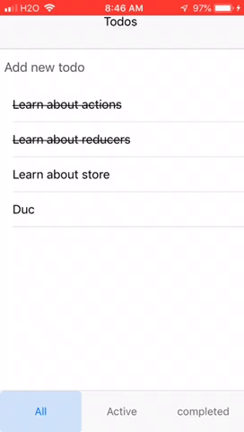

Todo app described in [Redux Basic Tutorial](https://redux.js.org/basics/basic-tutorial) implemented using `native-base` for UI.

# Setup
```
expo init native-base-redux --template blank@sdk-32 --yarn
cd native-base-redux
yarn add native-base --save
yarn add @expo/vector-icons --save
yarn start
```

# Step 1
Define actions in `actions.js` as described in [this section](https://redux.js.org/basics/actions).

We need to import `redux`:
```
yarn add redux --save
```
See [this diff](https://github.com/lubaochuan/native-base-redux/commit/b54b98d06cde19458f245be1c1d8d3ed296179c8) for solution.

# Step 2
Define reducers in `reducers.js` as described in [this section](https://redux.js.org/basics/reducers).

## Shape of State
```
{
  visibilityFilter: 'SHOW_ALL',
  todos: [
    {
      text: 'Consider using Redux',
      completed: true
    },
    {
      text: 'Keep all state in a single tree',
      completed: false
    }
  ]
}
```
See [this diff](https://github.com/lubaochuan/native-base-redux/commit/58b6fee5dbaf4c886c582da5124a671910cbe30b) for solution.

# Step 3
Setup redux store and test it as described in [this section](https://redux.js.org/basics/store).

```
yarn add redux --save
```

See [this diff](https://github.com/lubaochuan/native-base-redux/commit/621077c6c6da6610933ac14a66e13311b4975bb0) for solution.

# Step 4
Connect store to React as described in [this section](https://redux.js.org/basics/usage-with-react).
```
yarn add react-redux --save
```

See [this diff](https://github.com/lubaochuan/native-base-redux/commit/b8af0260feaef41aae2e9602542544c90bb1c417) for solution.

Add reverse data flow to add and toggle todos as discribed in
[usage with React section](https://redux.js.org/basics/usage-with-react).
We also add a logger trivially as a piece of middleware to Redux.

See [this diff](https://github.com/lubaochuan/native-base-redux/commit/e02e39505267558c0bebcd6e4eecdaf5768d68d0) for solution.

Add data flow for filter links.

See [this diff](https://github.com/lubaochuan/native-base-redux/commit/d97a7ce43527cad2f98537600929a1302b3f9616) for solution.

Here is a demo:

.
